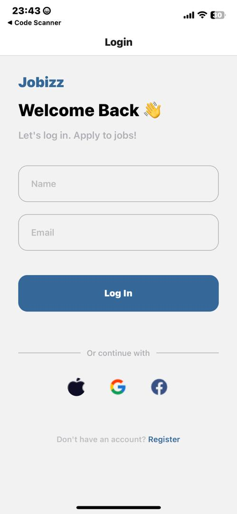
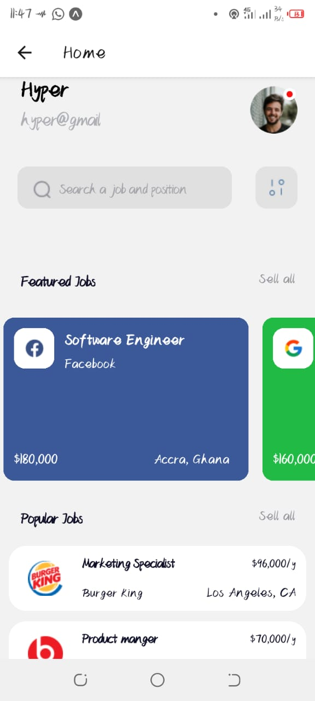

# 11126606

# Job Application Mobile App

This mobile application is designed to streamline the job application process by providing users with easy access to job listings and application features.

## Components

### LoginPage Component

The `LoginPage` component serves as the entry point for users to log in to the application. It includes fields for entering a username and email. Upon successful login, users are redirected to the Home page where they can explore job listings.

### HomePage Component

The `HomePage` component presents a personalized dashboard for logged-in users. It prominently displays their name and email, providing a seamless user experience. The Home page features two types of job listings:

- **Featured Jobs:** Displayed prominently to highlight top job opportunities.
- **Popular Jobs:** Listed based on popularity and relevance, providing a broad view of available positions.

#### FeaturedJobCard Component

The `FeaturedJobCard` component renders individual cards for featured job listings. Each card includes essential details such as job title, company name, salary, and location. This component is part of the Home page's featured jobs section.

#### PopularJobCard Component

The `PopularJobCard` component renders cards for popular job listings. These cards also include job title, company name, salary, and location details. They are displayed in a list format to give users quick access to diverse job options.

## Screenshots

### Login Page

### Home Page

